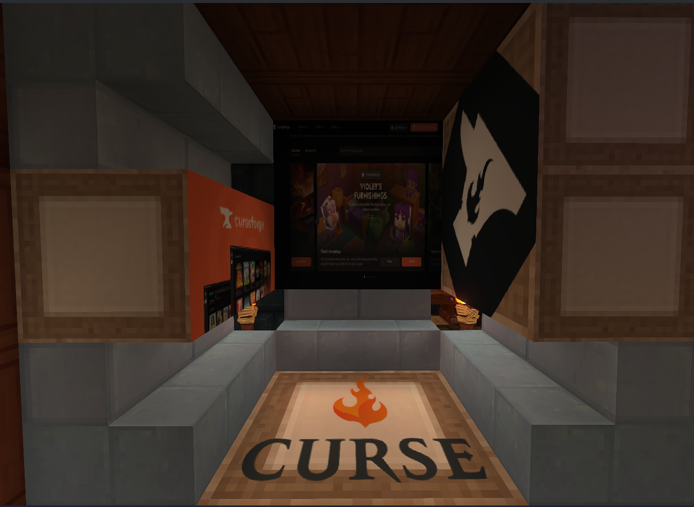
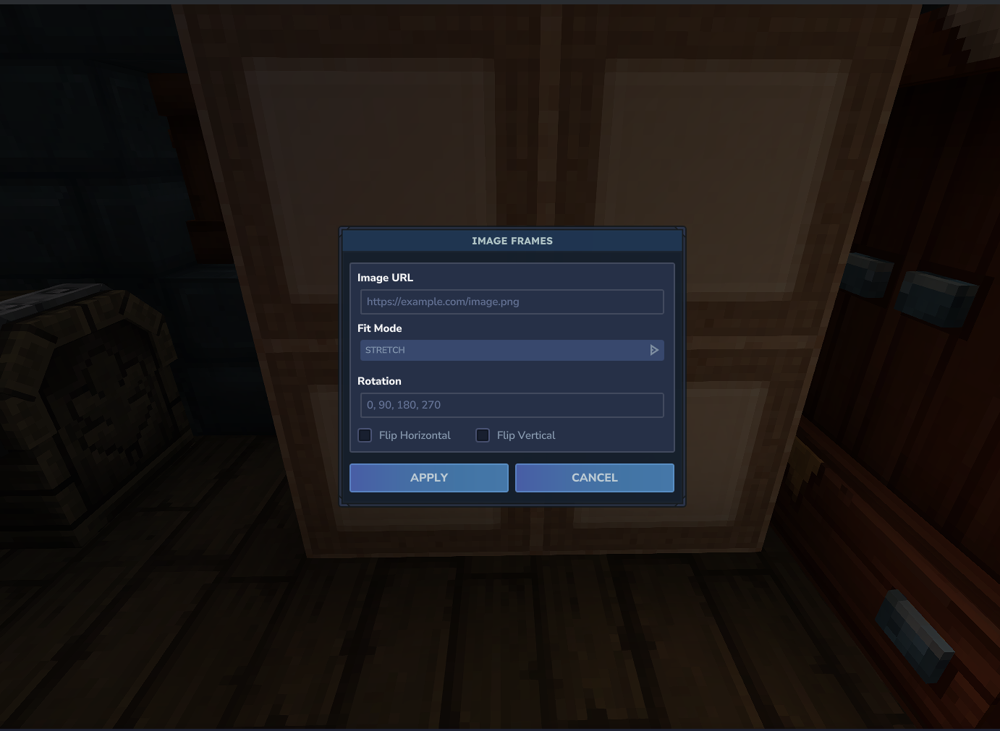
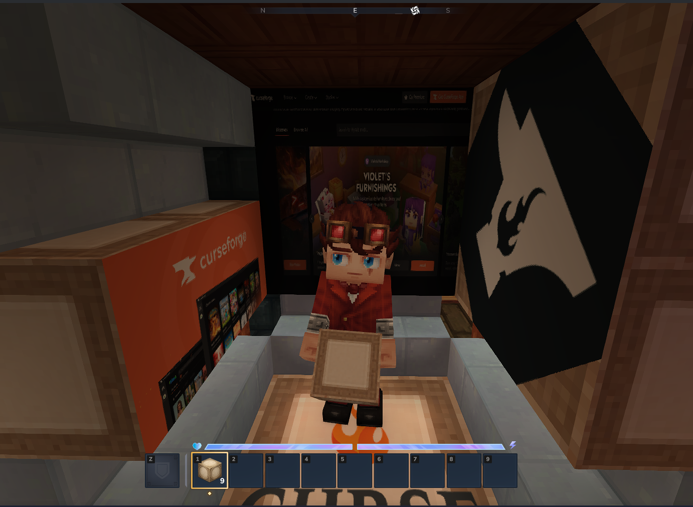

# ImageFrames

ImageFrames is a Hytale mod that facilitates the display of custom images on blocks within the game world. It allows players to define image sources (URLs), dimensions, and orientation for immersive decoration.

## Features

*   **Custom Images**: Load images via URL.
*   **Flexible Resizing**: Supports `stretch`, `crop`, and `contain` fit modes.
*   **Multi-Block Frames**: Create large displays spanning multiple blocks (e.g., 2x2, 3x2).
*   **Intuitive Orientation**:
    *   **Smart Face Detection**: Automatically determines the frame's facing direction based on the block face you interact with.
*   **Owner Locking**: Prevents other players from modifying your frames (configurable).
*   **Interactive UI**: Easy-to-use configuration menu when interacting with frame blocks.

## Usage

1.  **Place Frame Blocks**: Arrange the frame blocks in a rectangular shape (e.g., 1x1, 2x1, 2x2).
2.  **Interact**: Right-click the frame to open the configuration menu.
3.  **Configure**:
    *   **URL**: Enter the direct link to your image.
    *   **Fit**: Choose how the image fits the frame.
    *   **Rotation**: Rotate the image if needed.
    *   **Flip**: Flip horizontally or vertically.
4.  **Apply**: Click "Apply" to render the image.

### Resetting Frames
 To reset an ImageFrame, simply break one of the frame blocks and rebuild the structure. This will clear the current configuration.

## Screenshots

  
   
  <em>Showcase</em>

  
   
  <em>Configuration Interface</em>

  
   
  <em>Frame Block</em>

## Installation

1.  Build the project using `./gradlew build`.
2.  Place the generated JAR file into your Hytale's `mods` directory.

